 

 

 
 

 

<h2 align="center">About</h2>

I'm a backend engineer drawn to the parts of a system most people would rather not think about — the data model that still has to make sense in five years, the API contract a dozen other teams depend on, the failure mode that only shows up under real load at three in the morning.

My work centers on **Python** and **Django**, building **APIs** and **distributed systems** designed to stay predictable as traffic, data, and team size grow. Performance and security are treated as design constraints from the start, not something bolted on afterward, and I'd rather remove a clever piece of code than explain it for the third time.

There's always more to learn here, and that's most of the appeal.

 

<h2 align="center">Tech Stack</h2>

 

<table width="100%" style="border:none">
<tr>
<td width="18%" ><b>Languages</b></td>
<td style="border:none"> 

</td>
</tr>
<tr>
<td><b>Backend</b></td>
<td>

</td>
</tr>
<tr>
<td><b>Frontend</b></td>
<td>

</td>
</tr>
<tr>
<td><b>Databases</b></td>
<td>

</td>
</tr>
<tr>
<td><b>DevOps</b></td>
<td>

<!--  -->

</td>
</tr>
<tr>
<td><b>Infrastructure</b></td>
<td>

<!-- 
 -->
</td>
</tr>
<tr>
<!-- <td><b>Monitoring</b></td>
<td>

</td> -->
</tr>
<tr>
<!-- <td><b>Cloud</b></td>
<td>

</td>
</tr> -->
<tr>
<td><b>OS</b></td>
<td>

 
</td>
</tr>
<tr>
<td><b>Tools</b></td>
<td>

 
</td>
</tr>
</table>

<!--   -->

<!-- 
 -->

<!-- <h2 align="center">Technologies</h2> -->

 
 

  

<!--  

 -->
<!-- 
<h2 align="center">Featured Projects</h2>

  -->

<!-- <table width="100%">
<tr><td>

<h3>Distributed Task Orchestrator</h3>

A fault-tolerant scheduling layer for coordinating long-running background jobs across multiple workers, with retry policies, backoff, and dead-letter handling built in.

  

</td></tr>
</table>

 

<table width="100%">
<tr><td>

<h3>API Gateway &amp; Rate Limiter</h3>

A lightweight gateway sitting in front of internal APIs, handling authentication, request throttling, and structured logging for downstream observability.

  

</td></tr>
</table>

 

<table width="100%">
<tr><td>

<h3>Observability Stack</h3>

A self-hosted monitoring setup for containerized services — metrics collection, alerting rules, and dashboards tuned for fast incident response.

  

</td></tr>
</table> -->

 

<!-- 
 -->

<h2 align="center">GitHub Analytics</h2>

<!--   -->

<!--  -->

<!--    -->

<!--  -->

<!--    -->

<!--    -->

<!--  -->

<!--    -->

<!--  -->

<!--   -->

<!-- 
 -->

<h2 align="center">Engineering Principles</h2>

 

<table width="100%">
<tr>
<td width="25%" valign="top"><b>Clean Architecture</b> Clear boundaries between layers, so a change in one place doesn't ripple through everything else.</td>
<td width="25%" valign="top"><b>Readable Code</b> Code is read far more often than it's written — optimized for the next person, including future me.</td>
<td width="25%" valign="top"><b>Performance First</b> Efficiency is considered from the first design pass, not patched in after launch.</td>
<td width="25%" valign="top"><b>Security by Design</b> Threat modeling belongs in the design phase, not in a post-incident review.</td>
</tr>
<tr>
<td width="25%" valign="top"><b>Scalability</b> Systems built to handle growth in data, traffic, and team size without a rewrite.</td>
<td width="25%" valign="top"><b>Automation</b> If it's done more than twice, it should be scripted, tested, and version-controlled.</td>
<td width="25%" valign="top"><b>Maintainability</b> Software is a long-term liability — every decision is weighed against its upkeep cost.</td>
<td width="25%" valign="top"><b>Continuous Improvement</b> Refactoring and learning are part of the job, not extra credit.</td>
</tr>
</table>

 

<!-- 
 -->

 

<i>"A distributed system is one in which the failure of a computer you didn't even know existed can render your own computer unusable."</i>
  
— Leslie Lamport

 

<!-- 
 -->

<h2 align="center">Contact</h2>

 

<!--  -->

<!--  -->
 

 
